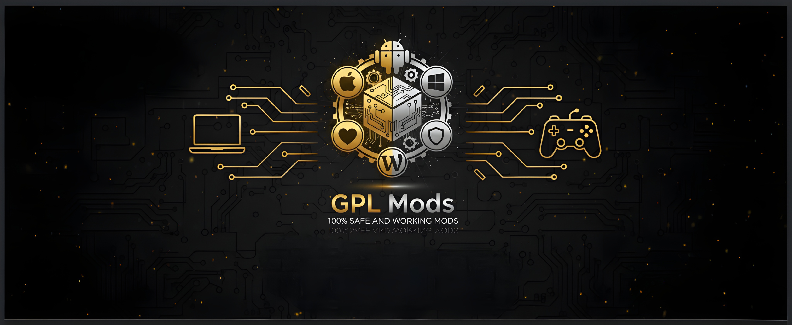
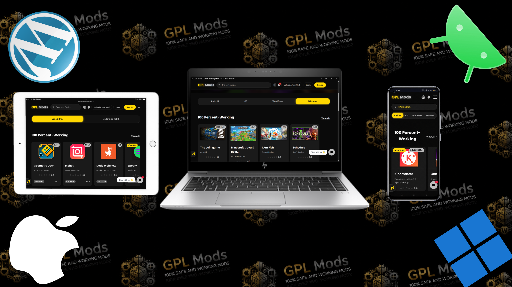
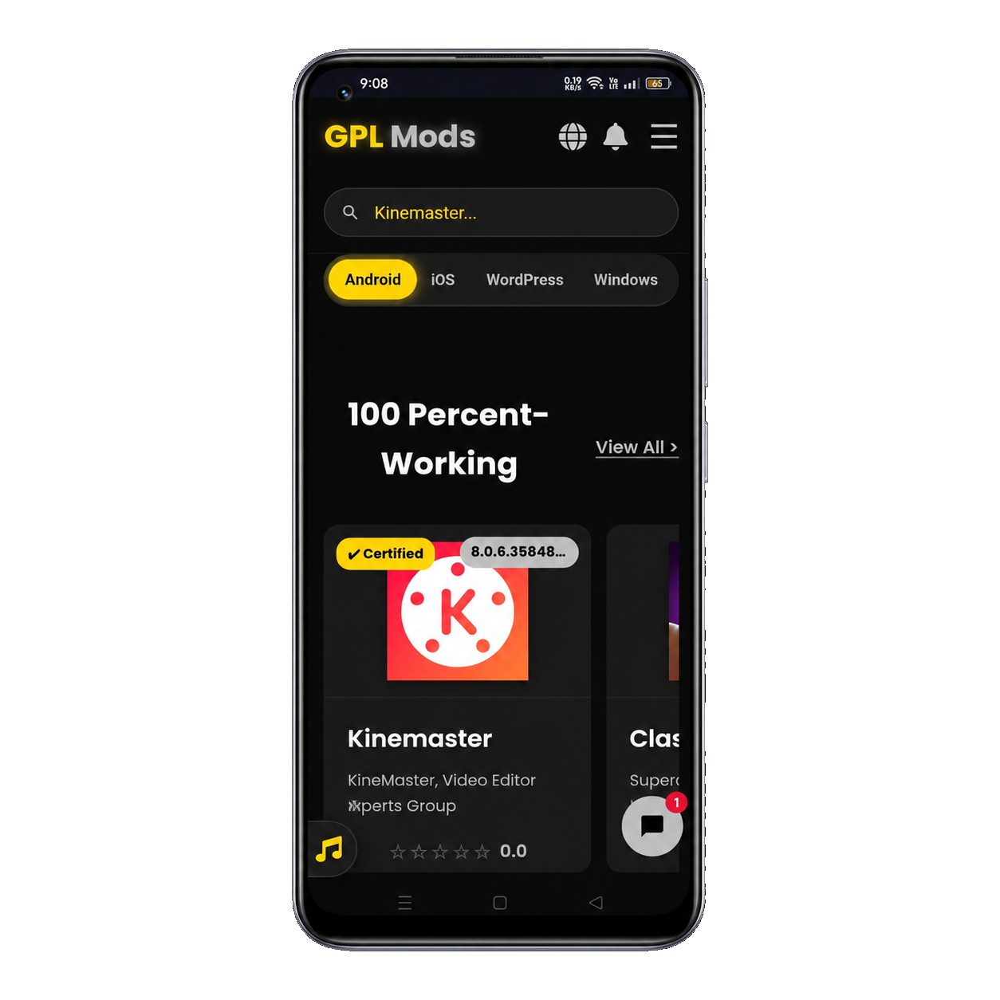
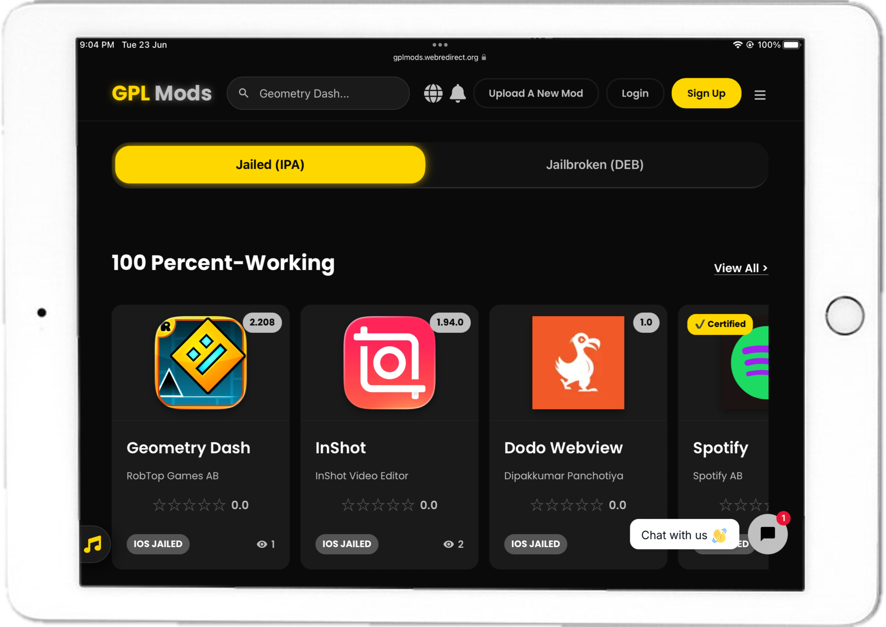

<!-- Rectangular Logo Placeholder -->

  

**The Ultimate Open-Source Modding Hub. 100% Safe, Cross-Platform, and Community-Driven.**

[Visit Website](https://gplmods.webredirect.org) &nbsp; &middot; &nbsp; [Report Bug](https://github.com/GPLMods-Team/GPLMods/issues) &nbsp; &middot; &nbsp; [Request Feature](https://github.com/GPLMods-Team/GPLMods/issues)

 

---

<h2 align="center">Experience Flawless Responsive Design</h2>

> Our platform is meticulously engineered to provide a seamless, dark-themed user experience across all devices, ensuring your modding journey is uninterrupted whether you are at your desk or on the go.

  <!-- Main Mockup Image containing all devices -->
  

 

| Mobile (iOS/Android) | Tablet / iPad | Windows Laptop |
|:---:|:---:|:---:|
|  |  |  |

*(Note: All branding assets and high-resolution screenshots are located in the `/assets` directory of this repository.)*

---

<h2 align="center">Platform Features at a Glance</h2>

*   **Inbuilt Documentation:** Comprehensive guides and transparent policies integrated directly into the platform interface.
*   **24/7 AI Active Support:** Instant, intelligent assistance for users via integrated chatbot architecture (Tidio).
*   **Powerful Admin Panel:** A fully customized back-office powered by **AdminJS** for total community, user, and content management.
*   **Live VirusTotal Integration:** Real-time API scans display exact threat metrics for every uploaded file.
*   **100% Safe Cross-Platform Mods:** Strict moderation ensures all mods (Android `.apk`, iOS `.ipa`/`.deb`, Windows `.exe`, WordPress `.zip`) function perfectly without malicious payloads. 14+ days of testing yields authentic "Certified Safe" badges.
*   **Rich Media Support:** Native integration with **Fluid Player** for fast video previews and **QuillJS** for rich-text descriptions and dynamic mod features.

---

<h2 align="center">Why Choose GPL Mods? (Us vs. Them)</h2>

> The modding community deserves better. Here is how GPL Mods is setting a new industry standard for safety, transparency, and user empowerment compared to traditional mod sites.

| Feature Area | GPL Mods (Our Standard) | Traditional Mod Sites |
| :--- | :--- | :--- |
| **Security & Transparency** | **Live VirusTotal Integration:** Real-time API scans with exact threat metrics. Authentic "Certified Safe" badges. | **Fake Certifications:** Scans are hidden, faked, or bypassed. High risk of injected malware and spyware. |
| **Platform Openness** | **Open-Source & Community-Driven:** Architecture is transparent. Code is publicly available to audit. | **Closed-Source Agendas:** Run by shadowy groups designed to harvest data without user knowledge. |
| **Download Experience** | **One-Click Direct Downloads:** Lightning-fast cloud servers. Premium members skip all distributor ads. | **Infinite Ad-Loops:** Dead mirrors, endless redirects, and aggressive PPD barriers. Malicious pop-unders. |
| **Community Metrics** | **Authentic Statistics:** Downloads, star ratings, and "Working" votes are driven by real, registered users. | **Manipulated Statistics:** Fake download counts and bot-generated reviews designed to mislead visitors. |
| **iOS / App Integration** | **Seamless Third-Party Support:** Dedicated integrations for SideStore, AltStore, Esign, F-Droid, and Neo Store. | **Fragmented Support:** Files provided raw, forcing users to install untrusted profile configurations. |
| **Creator Empowerment** | **Distributor Partnership Program:** Organizations can monetize their own links while leveraging our massive user base. | **No Creator Control:** Uploaders have zero sovereignty over their files or data once submitted. |

---

<h2 align="center">Our Core Principles</h2>

**Commitment to Safety**  
Your safety is our absolute priority. We provide mods only after 14+ days of rigorous testing. Every single file is scanned by over 100 antivirus engines via the VirusTotal API. If a harmful mod is detected, it is removed instantly, and the community is notified immediately.

**The Power of Community**  
GPL Mods doesn't just host files; we are a community hub. Mods are uploaded by members and trusted sources, strictly distributed under the GNU/GPL spirit. We are a platform run by the people, for the people, ensuring 100% working content.

**Open-Source Philosophy**  
We believe in absolute transparency. GPL Mods embraces the open-source philosophy to its core. Our platform's infrastructure and the mods we distribute thrive on community collaboration, allowing developers to audit, contribute, and improve the ecosystem securely.

---

<h2 align="center">Core Services & Tech Stack</h2>

  
  
  
  
   
  
  
  
  

---

<h2 align="center">Frequently Asked Questions</h2>

<strong>Are all the mods available on GPL MODS safe to use/download?</strong>

 
Safety is our first priority for every user. We check our mods with multiple antiviruses, and all mods provided here are tested for more than 14 days by our community members before receiving a Certified badge.

<strong>How do I install/download a .XAPK file?</strong>

 
A .XAPK file is a special type of Android file that contains both the APK and OBB data. It cannot be installed by the default Android package installer. You will need a dedicated XAPK installer app from the Play Store to install these files.

<strong>How do I install an .APK file?</strong>

 
To install an APK file, locate the downloaded file on your device. When you tap to open it, you may be prompted to "Enable unknown sources" in your device's security settings. After enabling this, you can proceed with the installation.

<strong>A mod I downloaded isn't working. What should I do?</strong>

 
First, ensure the mod you downloaded is compatible with your device and operating system (e.g., an iOS mod won't work on Android). For WordPress, check for version compatibility. For jailbroken tweaks, ensure your device's jailbreak status matches the tweak's requirements. You can also vote "Not Working" on the mod page to alert the community.

<strong>How do I upload a mod to GPL Mods?</strong>

 
You must be a registered member to share mods. After logging in, you can find an "Upload A New Mod" button in the header or on your profile page. Your submission will be tested by our team, and if it passes all safety checks, it will be made available to the community.

 

---

  
Built with determination by the GPL Community.

  

    <a href="https://gplmods.webredirect.org/tos">Terms of Service</a> | 
    <a href="https://gplmods.webredirect.org/privacy-policy">Privacy Policy</a> | 
    <a href="https://gplmods.webredirect.org/dmca">DMCA</a>
  

  
   

  <!-- Official Social Links with Alternating Gold/Silver Theme -->
  

    
    
    
    
    
  

  

    
    
    
    
    
  

